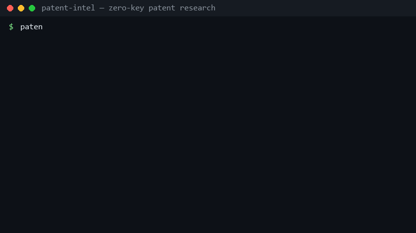

# patent-intel

**Ask patent questions in plain language. Get measured answers.**



A Claude Code skill + zero-dependency CLI for patent research: counts,
leaderboards, trends, portfolios, and full landscape reports over worldwide
patent publications — **no API key, no pip install** (Python 3.8+ stdlib only).

Three things this tool measured on day one (2026-08-18):

- The top filer of `"agentic AI"` patents isn't an AI lab — it's
  **Salesforce**, and **Citibank** is #4.
- **OpenAI has 85 patent publications. Anthropic has 19. NVIDIA has 33,226.**
- Filings mentioning `"large language model"`: **182 (2022) → 64,201 (2025)** —
  a ~350× ramp in three years.

Full analysis: [reports/2026-08-18-agentic-ai.md](reports/2026-08-18-agentic-ai.md)

## Quick start

### As a Claude Code plugin (recommended)

```
/plugin marketplace add kevin9327/patent-intel
/plugin install patent-intel@patent-intel
```

Then just ask Claude things like:

- *"Who is patenting retrieval-augmented generation?"*
- *"Has anyone patented on-device KV cache compression?"*
- *"Compare OpenAI, Microsoft and Salesforce on AI agent patents"*
- *"Give me a patent landscape report on humanoid robotics"*

### As a plain CLI (no Claude needed)

```bash
git clone https://github.com/kevin9327/patent-intel
cd patent-intel
python plugins/patent-intel/skills/patent-intel/scripts/patent_search.py leaderboard '"agentic AI"'
```

### Manual skill install

Copy `plugins/patent-intel/skills/patent-intel/` into `~/.claude/skills/`.

## Commands

| Command | Question it answers |
|---|---|
| `count '"solid state battery"'` | How many patent publications mention this? |
| `search '"KV cache"' --sort new --num 10` | What was filed recently? (with links) |
| `leaderboard '"retrieval augmented generation"'` | Who files the most in this space? |
| `trend '"large language model"' --from 2019` | Is patenting here accelerating? |
| `portfolio "Anthropic"` | What does this company patent? |
| `compare '"AI agent"' --assignees "OpenAI,Microsoft,Salesforce"` | Who leads among these? |
| `report --domain agentic-ai --out report.md` | Full landscape report for an area |
| `domains` | List curated domain packs |
| `selftest [--live]` | Verify the tool works |

Filters on most commands: `--country US|KR|EP|WO|...`, `--status GRANT`,
`--after 2024`, `--assignee`, `--inventor`, `--json` for machine-readable
output.

## Domain packs

Curated query sets for areas people actually ask about — one command gets you
a full landscape report (volumes, top filers, trend, fresh filings):

`agentic-ai` · `llm-core` · `rag` · `ai-inference` · `ai-chips` ·
`humanoid-robotics` · `autonomous-driving` · `ev-battery` ·
`industrial-inspection` · `digital-health` · `quantum-computing` · `space-tech`

See [domains.md](plugins/patent-intel/skills/patent-intel/references/domains.md)
for how packs are designed and how to add one.

## A repo that accumulates

[`data/snapshots/`](data/snapshots/) and [`reports/`](reports/) grow over time
(weekly workflow + manual runs): dated leaderboards, trends, and lab watchlist
counts. Over months this becomes a diffable public record of who is patenting
what in AI — something a one-off search can't give you.

## Politeness & limits

The zero-key backend is Google Patents' public search endpoint, so the CLI
behaves like a considerate guest: 24h response cache, 2s minimum spacing
(`PATENT_INTEL_DELAY` to raise), and honest back-off messages when Google
rate-limits a bursty IP (it does; wait 10-30 minutes). Interactive research is
fine — bulk collection is not what this backend is for. For bulk or production
use, official free-key APIs (USPTO, EPO OPS, KIPRIS, BigQuery) are the right
tool: see
[sources.md](plugins/patent-intel/skills/patent-intel/references/sources.md).

## Scope & legality

Patent publications are public documents; this tool reads public
bibliographic data, stores no personal data, and redistributes only small
aggregate snapshots (counts, rankings, links). Numbers are patent
*publications* (not grants or deduplicated families) unless filtered, recent
years are undercounted by the ~18-month publication lag, and leaderboard
facets are sampled. **Nothing here is legal advice** — for
infringement/freedom-to-operate questions, hire a patent attorney.

## Roadmap

- v0.2: official API backends behind env keys (`USPTO_API_KEY`,
  `EPO_KEY`/`EPO_SECRET`, `KIPRIS_API_KEY`) for bulk-safe collection
- Chart images in reports; more domain packs; family-level dedup

## 한국어

한국 특허청(KIPRIS Plus) 백엔드가 로드맵에 있습니다. 지금도
`--country KR`로 한국 공보를 검색할 수 있습니다:

```bash
python plugins/patent-intel/skills/patent-intel/scripts/patent_search.py search '"결함 검출"' --country KR --sort new
```

## License

MIT
